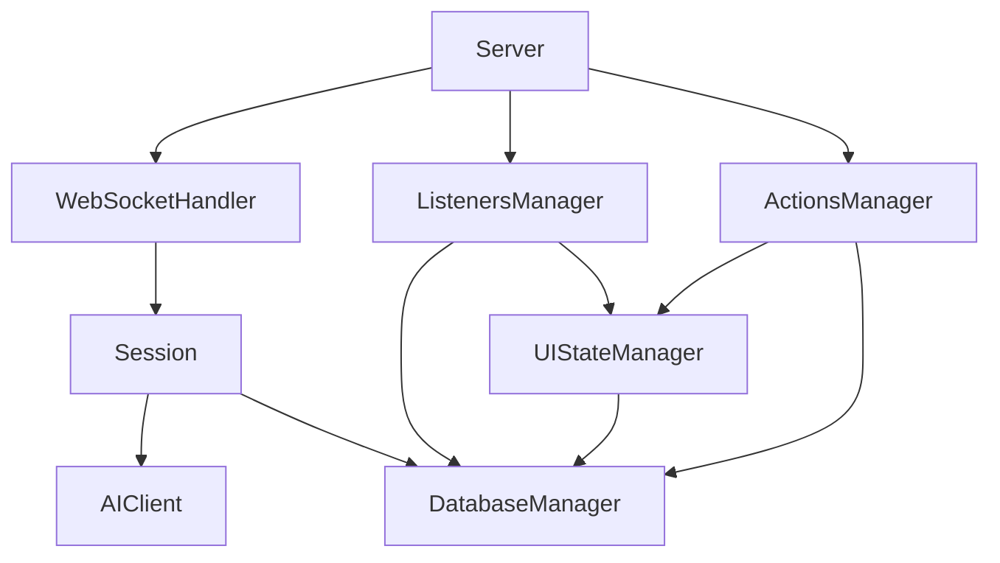

# Finance Agent 实现清单

> **文档目的**：系统化地列出所有需要实现的功能，确保 Python 迁移过程完整且有条理  
> **使用方式**：按优先级顺序实现，完成一项勾选一项，追踪进度

---

## 目录
- [优先级说明](#优先级说明)
- [Phase 1: 项目初始化](#phase-1-项目初始化)
- [Phase 2: 核心架构（P0）](#phase-2-核心架构p0)
- [Phase 3: 插件系统（P1）](#phase-3-插件系统p1)
- [Phase 4: 数据库层（P1）](#phase-4-数据库层p1)
- [Phase 5: 业务功能（P2）](#phase-5-业务功能p2)
- [Phase 6: 增强功能（P2）](#phase-6-增强功能p2)
- [Phase 7: 测试与优化（P3）](#phase-7-测试与优化p3)
- [Phase 8: 部署准备（P3）](#phase-8-部署准备p3)

---

## 优先级说明

| 优先级 | 说明 | 开发阶段 |
|--------|------|----------|
| **P0（必需）** | 系统核心功能，没有这些功能系统无法运行 | 第 1 周 |
| **P1（核心）** | 核心业务功能，提供基本可用性 | 第 2-3 周 |
| **P2（增强）** | 增强用户体验，提升系统完整度 | 第 4-5 周 |
| **P3（优化）** | 性能优化和边缘场景处理 | 第 6 周+ |

---

## Phase 1: 项目初始化

### 1.1 环境配置 (P0)
- [ ] 创建虚拟环境：`python -m venv venv`
- [ ] 初始化 `requirements.txt`：
  - [ ] `fastapi>=0.104.0`
  - [ ] `uvicorn[standard]>=0.24.0`
  - [ ] `anthropic>=0.7.0`
  - [ ] `sqlalchemy>=2.0.0`
  - [ ] `aiosqlite>=0.19.0`
  - [ ] `websockets>=12.0`
  - [ ] `python-dotenv>=1.0.0`
  - [ ] `watchdog>=3.0.0`
  - [ ] `pydantic>=2.0.0`
- [ ] 创建 `.env` 文件：
  - [ ] `ANTHROPIC_API_KEY=your_key_here`
  - [ ] `DATABASE_PATH=./data/finance.db`
  - [ ] `LOG_LEVEL=INFO`

### 1.2 项目结构 (P0)
```
finance-agent/
├── ccsdk/                  # SDK 核心模块
│   ├── __init__.py
│   ├── session.py
│   ├── websocket_handler.py
│   ├── listeners_manager.py
│   ├── actions_manager.py
│   └── ui_state_manager.py
├── database/               # 数据库层
│   ├── __init__.py
│   ├── database_manager.py
│   ├── schema.sql
│   └── models.py
├── agent/                  # 业务逻辑
│   └── custom_scripts/
│       ├── listeners/
│       ├── actions/
│       └── types.py
├── server/                 # 服务端
│   ├── __init__.py
│   ├── server.py
│   └── endpoints.py
├── client/                 # 前端（React）
│   └── (暂时跳过，先完成后端)
├── tests/                  # 测试
│   ├── test_session.py
│   └── test_database.py
├── .env
├── requirements.txt
└── README.md
```

- [ ] 创建上述目录结构
- [ ] 初始化所有 `__init__.py` 文件
- [ ] 创建 `README.md` 包含启动说明

---

## Phase 2: 核心架构（P0）

> ⚠️ **重要提示**：虽然 Session 类排在前面，但建议先完成 **Phase 2.0（数据库设计评审）**，确保数据模型正确后再开始编码。

### 2.0 数据库设计评审（P0 - 前置任务）
**参考文档**：`DATABASE_SCHEMA.md`

- [ ] 阅读 `DATABASE_SCHEMA.md`，理解表结构设计
- [ ] 确认 Finance Agent 的核心业务实体：
  - [ ] **Transaction（交易）**：id, amount, date, category, merchant, account
  - [ ] **Account（账户）**：是否需要单独建表？
  - [ ] **Category（分类）**：固定枚举 vs 动态表？
  - [ ] **Budget（预算）**：是否纳入 MVP 范围？
- [ ] 绘制 ER 图（实体关系图）
- [ ] 评审索引设计（查询性能）
- [ ] 确认迁移策略（SQLAlchemy Alembic vs 手动 SQL）
- [ ] **评审通过后才继续 Phase 2.1**

**输出产物**：
- [ ] `database/ER_DIAGRAM.md`（ER 图）
- [ ] `database/schema.sql`（初始版本）
- [ ] `database/models.py`（SQLAlchemy 模型定义）

**测试检查点**：
- [ ] 手动执行 `schema.sql` 验证语法
- [ ] 使用 SQLAlchemy 创建表，检查外键约束

---

### 2.1 Session 类实现 (P0)
**参考文档**：`SESSION_FLOW.md`

**文件**：`ccsdk/session.py`

- [x] 定义 `Session` 类基础结构
  - [x] `__init__(self, session_id: str, db)`
  - [x] `id: str` 属性
  - [x] `_query_lock: asyncio.Lock` 并发控制锁
  - [x] `_subscribers: Set[WSClient]` 订阅者集合
  - [x] `_sdk_session_id: Optional[str]` 多轮对话 ID

- [x] 实现 `add_user_message()` 方法
  - [x] 使用 `async with self._query_lock` 控制并发
  - [x] 调用 `AIClient.query_stream()` 获取流式响应
  - [x] 捕获 `sdk_session_id` 用于多轮对话
  - [x] 错误处理和日志记录
  - [x] **P1 修复**: 正确更新 `_is_querying` 状态

- [x] 实现 `subscribe()` 方法
  - [x] 添加客户端到 `_subscribers`
  - [x] 发送会话初始化消息

- [x] 实现 `unsubscribe()` 方法
  - [x] 从 `_subscribers` 移除客户端

- [x] 实现 `_broadcast_to_subscribers()` 方法
  - [x] 将消息序列化为 JSON
  - [x] 遍历所有订阅者发送消息
  - [x] 处理发送失败的客户端（自动移除）

- [x] 实现 `cleanup()` 方法
  - [x] 清空订阅者
  - [x] 释放资源

- [x] 实现 `end_conversation()` 方法
  - [x] **P1 修复**: 重置所有状态（sdk_session_id + _is_querying）

**测试检查点**：
- [x] 编写单元测试 `scripts/test_session_fixes.py`
- [x] 测试并发消息处理（两个消息按顺序执行）
- [x] 测试多轮对话（`sdk_session_id` 保持一致）
- [x] 测试订阅者广播（所有客户端收到消息）
- [x] 测试 P0/P1 修复效果

**实现状态**: ✅ **已完成并修复** (2024-11-28)
- 文件: `ccsdk/session.py` (347 行)
- 测试: `scripts/test_session_fixes.py` (215 行)
- 文档: `SESSION_FIXES.md` (修复总结)
- P0 修复: AIClient 消息格式（支持 tool_use）
- P1 修复: 状态管理（_is_querying + end_conversation）

---

### 2.2 AIClient 类实现 (P0)
**文件**：`ccsdk/ai_client.py`

- [x] 定义 `AIClient` 类
  - [x] 初始化 Claude Agent SDK 客户端
  - [x] 配置 API 密钥（从环境变量读取）

- [x] 实现 `query_stream()` 异步生成器
  - [x] 支持 `resume` 参数（多轮对话）
  - [x] 流式返回 SDK 消息
  - [x] 处理 `assistant`、`tool_use`、`tool_result`、`result`、`system` 消息类型
  - [x] **P0 修复**: 保留完整的 content 块结构（支持 tool_use）

- [x] 实现 `_convert_sdk_message()` 方法
  - [x] 转换 AssistantMessage（保留 text、tool_use、tool_result 块）
  - [x] 转换 SystemMessage
  - [x] 转换 ResultMessage
  - [x] 转换 UserMessage

- [x] 实现错误处理
  - [x] 错误日志记录
  - [ ] API 超时重试（待完善）
  - [ ] 速率限制处理（待完善）

**测试检查点**：
- [x] 测试单轮对话
- [x] 测试多轮对话（使用 `resume`）
- [x] 测试流式响应解析
- [x] 测试消息类型转换（P0 修复验证）

**实现状态**: ✅ **已完成并修复** (2024-11-28)
- 文件: `ccsdk/ai_client.py` (272 行)
- P0 修复: 消息格式转换（完整保留 tool_use 等块）
- 集成测试: 通过 `test_session_fixes.py` 验证

---

### 2.3 WebSocketHandler 类实现 (P0)
**参考文档**：`WEBSOCKET_HANDLER.md`

**文件**：`ccsdk/websocket_handler.py`

- [x] 定义 `WebSocketHandler` 类
  - [x] `sessions: Dict[str, Session]` 会话管理字典
  - [x] `clients: Dict[str, WSClient]` 客户端管理字典

- [x] 实现 `start()` / `stop()` 方法
  - [x] 启动报告数据监控任务
  - [x] 清理所有资源

- [x] 实现 `on_open()` 方法
  - [x] 接受 WebSocket 连接
  - [x] 发送连接确认消息
  - [x] 发送初始报告列表

- [x] 实现 `on_message()` 方法
  - [x] 解析 JSON 消息
  - [x] 处理 `chat` 消息（聊天对话）
  - [x] 处理 `subscribe` 消息（订阅 Session）
  - [x] 处理 `unsubscribe` 消息（取消订阅）
  - [x] 处理 `request_reports` 消息（请求报告列表）
  - [x] 错误处理（无效消息格式）

- [x] 实现 `on_close()` 方法
  - [x] 从会话中取消订阅
  - [x] 清理无订阅者的会话

- [x] 实现数据广播方法
  - [x] `_broadcast_reports_update()` - 广播报告列表
  - [x] `_broadcast_ui_state_update()` - 广播 UI 状态更新

- [x] 实现自动推送
  - [x] `_init_report_watcher()` - 每 5 秒自动推送报告列表

**测试检查点**：
- [x] 编写完整测试 `tests/test_websocket_handler.py` (384 行)
- [x] 测试 WebSocket 连接建立
- [x] 测试会话创建和订阅
- [x] 测试消息广播
- [x] 测试数据自动推送 (5 秒轮询)
- [x] 测试并发聊天
- [x] 测试错误处理

**实现状态**: ✅ **已完成** (2024-11-27)
- 文件: `ccsdk/websocket_handler.py` (374 行)
- 测试: `scripts/test_websocket_handler.py` (384 行)
- 文档: `WEBSOCKET_HANDLER.md` (425 行)
- 对应 TS: `websocket-handler.ts` (666 行)

---

## Phase 3: 插件系统（P1）

### 3.1 ListenersManager 实现 (P1)
**参考文档**：`PLUGIN_LOADING.md`, `LISTENER_TEMPLATE.md`

**文件**：`ccsdk/listeners_manager.py`

- [ ] 定义 `ListenersManager` 类
  - [ ] `_listeners: Dict[str, ListenerModule]` 监听器存储
  - [ ] `_listeners_dir: str` 监听器脚本目录

- [ ] 实现 `load_all_listeners()` 方法
  - [ ] 扫描 `agent/custom_scripts/listeners/` 目录
  - [ ] 动态导入所有 `.py` 文件（跳过 `_` 和 `.` 开头）
  - [ ] 验证 `config` 和 `handler` 存在
  - [ ] 只加载 `enabled=True` 的监听器

- [ ] 实现 `_load_listener()` 方法
  - [ ] 使用 `importlib.import_module()` 动态加载
  - [ ] 清除 `sys.modules` 缓存实现热重载
  - [ ] 错误处理（语法错误、缺少必需字段）

- [ ] 实现 `check_event()` 方法
  - [ ] 根据 `event` 类型匹配监听器
  - [ ] 执行所有匹配的 `handler`
  - [ ] 记录执行时间和结果
  - [ ] 写入 JSONL 日志文件

- [ ] 实现 `_create_context()` 方法
  - [ ] 创建 `ListenerContext` 对象
  - [ ] 注入 `notify()`, `call_agent()`, `ui_state` 方法
  - [ ] 注入交易操作方法（对应 Email Agent 的邮件操作）

- [ ] 实现 `watch_listeners()` 方法
  - [ ] 使用 `watchdog` 监听文件变化
  - [ ] 文件修改时自动重新加载
  - [ ] 触发回调通知前端

**测试检查点**：
- [ ] 编写示例监听器 `test_listener.py`
- [ ] 测试监听器加载（`load_all_listeners()`）
- [ ] 测试事件触发（`check_event()`）
- [ ] 测试热重载（修改文件后自动加载）
- [ ] 测试日志写入（JSONL 格式）

---

### 3.2 ActionsManager 实现 (P1)
**参考文档**：`ACTION_TEMPLATE.md`

**文件**：`ccsdk/actions_manager.py`

- [ ] 定义 `ActionsManager` 类
  - [ ] `_templates: Dict[str, ActionModule]` 动作模板存储
  - [ ] `_instances: Dict[str, ActionInstance]` 动作实例存储

- [ ] 实现 `load_all_templates()` 方法
  - [ ] 扫描 `agent/custom_scripts/actions/` 目录
  - [ ] 动态导入所有 `.py` 文件
  - [ ] 验证 `config` 和 `handler` 存在

- [ ] 实现 `register_instance()` 方法
  - [ ] 由 Agent 创建动作实例时调用
  - [ ] 存储实例信息（`instanceId`, `templateId`, `params`）

- [ ] 实现 `execute_action()` 方法
  - [ ] 根据 `instanceId` 查找实例
  - [ ] 获取对应的模板 `handler`
  - [ ] 创建 `ActionContext` 对象
  - [ ] 执行 `handler(params, context)`
  - [ ] 记录执行结果和时间
  - [ ] 写入 JSONL 日志文件

- [ ] 实现 `_create_context()` 方法
  - [ ] 创建 `ActionContext` 对象
  - [ ] 注入 `log()`, `notify()`, `call_agent()` 方法
  - [ ] 注入 `ui_state`, `transactions` 操作方法

- [ ] 实现 `watch_templates()` 方法
  - [ ] 使用 `watchdog` 监听文件变化

**测试检查点**：
- [ ] 编写示例动作 `test_action.py`
- [ ] 测试动作模板加载
- [ ] 测试动作实例注册
- [ ] 测试动作执行（`execute_action()`）
- [ ] 测试参数验证（JSON Schema）

---

### 3.3 UIStateManager 实现 (P1)
**文件**：`ccsdk/ui_state_manager.py`

- [ ] 定义 `UIStateManager` 类
  - [ ] `_db_manager: DatabaseManager` 数据库依赖

- [ ] 实现 `get_state()` 方法
  - [ ] 调用 `DatabaseManager.get_ui_state()`
  - [ ] 返回状态数据（解析 JSON）

- [ ] 实现 `set_state()` 方法
  - [ ] 序列化数据为 JSON
  - [ ] 调用 `DatabaseManager.set_ui_state()`
  - [ ] 广播状态更新（通过 WebSocket）

- [ ] 实现 `load_all_templates()` 方法
  - [ ] 扫描 `agent/custom_scripts/ui_states/` 目录
  - [ ] 加载所有 UI 状态模板

- [ ] 实现 `watch_templates()` 方法
  - [ ] 监听模板文件变化

**测试检查点**：
- [ ] 测试状态读写
- [ ] 测试状态广播

---

## Phase 4: 数据库层（P1）

> 📌 **注意**：此阶段的模型定义应该是 Phase 2.0 设计的**实现和完善**，而非首次设计。

### 4.1 SQLAlchemy 模型完善 (P1)
**参考文档**：`DATABASE_SCHEMA.md`

**文件**：`database/models.py`

> ⚠️ 前置条件：Phase 2.0 的数据库设计已评审通过

- [ ] 定义 `Base` 基类（使用 `declarative_base()`）

- [ ] 定义 `Transaction` 模型（对应 Email Agent 的 `emails` 表）
  - [ ] `id: int` (主键)
  - [ ] `transaction_id: str` (唯一索引)
  - [ ] `date: datetime` (交易日期)
  - [ ] `amount: float` (金额)
  - [ ] `category: str` (类别，可选)
  - [ ] `description: str` (描述，可选)
  - [ ] `merchant: str` (商家名称，可选)
  - [ ] `account: str` (账户)
  - [ ] `is_expense: bool` (是否为支出)
  - [ ] `is_recurring: bool` (是否为定期交易)
  - [ ] `tags: str` (JSON 字符串，标签数组)
  - [ ] `created_at: datetime`
  - [ ] `updated_at: datetime`

- [ ] 定义 `UIState` 模型
  - [ ] `id: int`
  - [ ] `state_id: str` (唯一索引)
  - [ ] `data_json: str` (JSON 数据)
  - [ ] `created_at: datetime`
  - [ ] `updated_at: datetime`

- [ ] 定义 `ComponentInstance` 模型
  - [ ] `id: int`
  - [ ] `instance_id: str` (唯一索引)
  - [ ] `component_id: str`
  - [ ] `state_id: str`
  - [ ] `session_id: str` (可选)
  - [ ] `created_at: datetime`

**测试检查点**：
- [ ] 测试模型创建（`Base.metadata.create_all()`）
- [ ] 测试字段类型和约束

---

### 4.2 DatabaseManager 实现 (P1)
**文件**：`database/database_manager.py`

- [ ] 定义 `DatabaseManager` 单例类
  - [ ] `_instance: Optional[DatabaseManager]` 单例实例
  - [ ] `_engine: AsyncEngine` 异步引擎
  - [ ] `_session_factory: sessionmaker` 会话工厂

- [ ] 实现 `__new__()` 单例模式
  - [ ] 确保只创建一个实例

- [ ] 实现 `get_instance()` 类方法
  - [ ] 返回单例实例

- [ ] 实现 `initialize()` 方法
  - [ ] 创建 `AsyncEngine`（`sqlite+aiosqlite`）
  - [ ] 执行 `schema.sql` 初始化表结构
  - [ ] 创建索引

- [ ] 实现 `upsert_transaction()` 方法
  - [ ] 插入或更新交易记录
  - [ ] 处理标签数组（JSON 序列化）
  - [ ] 返回交易 ID

- [ ] 实现 `search_transactions()` 方法
  - [ ] 支持多条件搜索（日期范围、金额范围、类别、商家）
  - [ ] 支持全文搜索（使用 FTS5，可选）
  - [ ] 分页（`limit`, `offset`）

- [ ] 实现 `get_transaction_by_id()` 方法
  - [ ] 根据 `transaction_id` 查询

- [ ] 实现 UI 状态操作方法
  - [ ] `get_ui_state(state_id: str)`
  - [ ] `set_ui_state(state_id: str, data: Any)`
  - [ ] `list_ui_states()`
  - [ ] `delete_ui_state(state_id: str)`

- [ ] 实现 `register_component_instance()` 方法
  - [ ] 注册组件实例到数据库

**测试检查点**：
- [ ] 编写测试 `tests/test_database.py`
- [ ] 测试单例模式（多次调用 `get_instance()` 返回同一实例）
- [ ] 测试交易插入和查询
- [ ] 测试搜索功能
- [ ] 测试 UI 状态读写

---

### 4.3 数据库初始化脚本 (P1)
**文件**：`database/schema.sql`

- [ ] 定义 `transactions` 表
  - [ ] 所有字段定义
  - [ ] 索引（`transaction_id`, `date`, `category`, `account`）
  - [ ] 触发器（自动更新 `updated_at`）

- [ ] 定义 `ui_states` 表
  - [ ] 字段和索引

- [ ] 定义 `component_instances` 表
  - [ ] 字段和索引

- [ ] （可选）定义 FTS5 虚拟表
  - [ ] 用于全文搜索交易描述和商家名称

**执行检查**：
- [ ] 手动执行 SQL 文件验证语法
- [ ] 通过 `DatabaseManager.initialize()` 自动执行

---

## Phase 5: 业务功能（P2）

### 5.1 服务端实现 (P2)
**文件**：`server/server.py`

- [ ] 创建 FastAPI 应用
  - [ ] `app = FastAPI()`
  - [ ] 配置 CORS 中间件

- [ ] 实现 WebSocket 端点 `/ws`
  - [ ] 接受连接
  - [ ] 调用 `WebSocketHandler.on_connect()`
  - [ ] 接收消息并调用 `WebSocketHandler.on_message()`
  - [ ] 断开连接时调用 `WebSocketHandler.on_disconnect()`

- [ ] 实现 REST API 端点
  - [ ] `GET /api/transactions` - 获取交易列表
  - [ ] `POST /api/transactions/search` - 搜索交易
  - [ ] `GET /api/transaction/{id}` - 获取交易详情
  - [ ] `GET /api/listeners` - 获取所有监听器
  - [ ] `GET /api/listener/{id}/logs` - 获取监听器日志
  - [ ] `GET /api/ui-states` - 获取所有 UI 状态
  - [ ] `GET /api/ui-state/{id}` - 获取 UI 状态
  - [ ] `PUT /api/ui-state/{id}` - 更新 UI 状态
  - [ ] `DELETE /api/ui-state/{id}` - 删除 UI 状态

- [ ] 实现启动逻辑
  - [ ] 初始化 `DatabaseManager`
  - [ ] 加载所有监听器、动作、UI 状态模板
  - [ ] 启动文件监听器（热重载）

- [ ] 实现 `main()` 入口
  - [ ] 使用 `uvicorn.run()` 启动服务器
  - [ ] 配置端口（默认 3000）

**测试检查点**：
- [ ] 启动服务器：`python server/server.py`
- [ ] 访问 `http://localhost:3000/docs`（FastAPI 自动文档）
- [ ] 测试 WebSocket 连接（使用 `wscat` 工具）
- [ ] 测试 REST API 端点（使用 `curl` 或 Postman）

---

### 5.2 端点处理函数 (P2)
**文件**：`server/endpoints.py`

- [ ] 实现 `handle_transactions_endpoint()`
  - [ ] 调用 `DatabaseManager.search_transactions()`
  - [ ] 返回 JSON 响应

- [ ] 实现 `handle_search_endpoint()`
  - [ ] 解析请求体（搜索条件）
  - [ ] 调用 `DatabaseManager.search_transactions()`

- [ ] 实现 `handle_transaction_details_endpoint()`
  - [ ] 调用 `DatabaseManager.get_transaction_by_id()`

- [ ] 实现 `handle_listeners_endpoint()`
  - [ ] 调用 `ListenersManager.get_all_listeners()`

- [ ] 实现 `handle_listener_logs_endpoint()`
  - [ ] 调用 `LogWriter.read_logs()`

- [ ] 实现 UI 状态端点处理函数
  - [ ] `handle_get_ui_state()`
  - [ ] `handle_set_ui_state()`
  - [ ] `handle_list_ui_states()`

**测试检查点**：
- [ ] 测试每个端点的正常响应
- [ ] 测试错误处理（404, 500）

---

### 5.3 示例监听器和动作 (P2)

**监听器示例**：`agent/custom_scripts/listeners/transaction_classifier.py`
- [ ] 参考 `LISTENER_TEMPLATE.md` 编写
- [ ] 实现交易分类逻辑（使用 AI）
- [ ] 更新 UI 状态

**动作示例**：`agent/custom_scripts/actions/add_expense.py`
- [ ] 参考 `ACTION_TEMPLATE.md` 编写
- [ ] 实现添加费用功能
- [ ] 参数验证（JSON Schema）

**测试检查点**：
- [ ] 触发监听器（插入新交易）
- [ ] 验证监听器日志
- [ ] 执行动作（通过 WebSocket）
- [ ] 验证动作结果

---

## Phase 6: 增强功能（P2）

### 6.1 日志系统 (P2)
**文件**：`ccsdk/log_writer.py`

- [ ] 定义 `LogWriter` 类
  - [ ] 写入 JSONL 格式日志
  - [ ] 按日期分文件（`YYYY-MM-DD.jsonl`）

- [ ] 实现 `append_log()` 方法
  - [ ] 异步写入日志

- [ ] 实现 `read_logs()` 方法
  - [ ] 读取指定监听器的日志
  - [ ] 支持分页（`limit`）

**测试检查点**：
- [ ] 测试日志写入
- [ ] 测试日志读取

---

### 6.2 热重载系统 (P2)
**文件**：`ccsdk/file_watcher.py`

- [ ] 使用 `watchdog` 库实现文件监听
- [ ] 定义 `ChangeHandler(FileSystemEventHandler)`
  - [ ] 重写 `on_modified()` 方法
  - [ ] 触发重新加载回调

- [ ] 集成到 `ListenersManager` 和 `ActionsManager`

**测试检查点**：
- [ ] 修改监听器文件，验证自动重新加载
- [ ] 验证前端收到更新通知

---

### 6.3 全文搜索（可选）(P2)
**文件**：`database/fts_manager.py`

- [ ] 创建 FTS5 虚拟表
  - [ ] 索引交易描述、商家名称

- [ ] 实现 `search_transactions_fts()` 方法
  - [ ] 使用 FTS5 MATCH 语法

- [ ] 创建触发器自动更新 FTS 索引

**测试检查点**：
- [ ] 测试全文搜索性能（vs 普通 LIKE 查询）

---

## Phase 7: 测试与优化（P3）

### 7.1 单元测试 (P3)
**目录**：`tests/`

- [ ] `test_session.py`
  - [ ] 测试并发控制
  - [ ] 测试多轮对话
  - [ ] 测试订阅者管理

- [ ] `test_database.py`
  - [ ] 测试交易 CRUD
  - [ ] 测试搜索功能
  - [ ] 测试 UI 状态管理

- [ ] `test_listeners.py`
  - [ ] 测试监听器加载
  - [ ] 测试事件匹配
  - [ ] 测试上下文注入

- [ ] `test_actions.py`
  - [ ] 测试动作加载
  - [ ] 测试动作执行
  - [ ] 测试参数验证

**执行**：
- [ ] 运行 `pytest tests/`
- [ ] 代码覆盖率 > 80%

---

### 7.2 集成测试 (P3)
**文件**：`tests/test_integration.py`

- [ ] 测试完整会话流程
  - [ ] 创建会话
  - [ ] 发送用户消息
  - [ ] 接收 AI 响应
  - [ ] 执行动作
  - [ ] 触发监听器

- [ ] 测试多客户端场景
  - [ ] 多个客户端订阅同一会话
  - [ ] 广播消息到所有客户端

**执行**：
- [ ] 启动服务器
- [ ] 运行集成测试

---

### 7.3 性能优化 (P3)

- [ ] 数据库查询优化
  - [ ] 使用索引
  - [ ] 避免 N+1 查询
  - [ ] 使用连接池

- [ ] 异步优化
  - [ ] 使用 `asyncio.gather()` 并行执行
  - [ ] 避免阻塞操作

- [ ] 内存优化
  - [ ] 定期清理过期会话
  - [ ] 限制订阅者数量

**性能基准**：
- [ ] 并发连接数 > 100
- [ ] 消息处理延迟 < 100ms
- [ ] 数据库查询 < 50ms

---

### 7.4 错误处理和日志 (P3)

- [ ] 统一错误响应格式
  - [ ] `{ "error": "message", "code": 400 }`

- [ ] 日志级别配置
  - [ ] `DEBUG`, `INFO`, `WARNING`, `ERROR`

- [ ] 异常捕获
  - [ ] 全局异常处理器（FastAPI `@app.exception_handler`）

**测试检查点**：
- [ ] 测试各种异常场景
- [ ] 验证日志输出

---

## Phase 8: 部署准备（P3）

### 8.1 环境配置 (P3)

- [ ] 创建 `config.py` 统一配置管理
  - [ ] 从环境变量读取配置
  - [ ] 提供默认值

- [ ] 创建 `.env.example` 模板文件

- [ ] 文档化环境变量说明

---

### 8.2 容器化（可选）(P3)

- [ ] 创建 `Dockerfile`
  - [ ] 基于 `python:3.11-slim`
  - [ ] 安装依赖
  - [ ] 复制代码
  - [ ] 暴露端口 3000

- [ ] 创建 `docker-compose.yml`
  - [ ] 定义服务（backend, frontend）
  - [ ] 挂载数据卷（数据库文件）

**测试检查点**：
- [ ] 构建镜像：`docker build -t finance-agent .`
- [ ] 运行容器：`docker run -p 3000:3000 finance-agent`

---

### 8.3 文档完善 (P3)

- [ ] 更新 `README.md`
  - [ ] 安装说明
  - [ ] 启动命令
  - [ ] API 文档链接
  - [ ] 开发指南

- [ ] 创建 `CONTRIBUTING.md`
  - [ ] 贡献流程
  - [ ] 代码规范

- [ ] 创建 `API.md`
  - [ ] 所有端点说明
  - [ ] 请求/响应示例

---

## 进度追踪

### 完成度统计
- [ ] Phase 1: 项目初始化 (0/2)
- [ ] Phase 2: 核心架构 (0/3)
- [ ] Phase 3: 插件系统 (0/3)
- [ ] Phase 4: 数据库层 (0/3)
- [ ] Phase 5: 业务功能 (0/3)
- [ ] Phase 6: 增强功能 (0/3)
- [ ] Phase 7: 测试与优化 (0/4)
- [ ] Phase 8: 部署准备 (0/3)

### 总体进度：0% (0/24)

---

## 里程碑

### Milestone 1: MVP 可运行 (Week 2)
- [ ] 完成 Phase 1（项目初始化）
- [ ] 完成 Phase 2.0（数据库设计评审）✅ **关键前置任务**
- [ ] 完成 Phase 2.1-2.3（Session 和 WebSocket）
- [ ] Session 和 WebSocket 基本可用
- [ ] 可以创建会话并发送消息

### Milestone 2: 核心功能完整 (Week 4)
- [ ] 完成 Phase 3-4
- [ ] 监听器和动作系统可用
- [ ] 数据库操作完整

### Milestone 3: 生产就绪 (Week 6)
- [ ] 完成 Phase 5-7
- [ ] 测试覆盖率 > 80%
- [ ] 性能满足基准

### Milestone 4: 部署上线 (Week 7+)
- [ ] 完成 Phase 8
- [ ] 文档完善
- [ ] 部署到生产环境

---

## 维护建议

1. **每日检查**：完成一个任务勾选一个，保持进度可见
2. **每周回顾**：检查是否偏离计划，调整优先级
3. **问题记录**：遇到技术难点记录到 `ISSUES.md`
4. **定期更新**：根据实际开发情况更新清单

---

## 附录：关键依赖关系



**实现顺序建议**：
1. DatabaseManager → Session → WebSocketHandler
2. ListenersManager → ActionsManager → UIStateManager
3. Server → Endpoints → 示例脚本

---

**最后更新**：初始版本  
**下次审查**：完成 Phase 1 后
