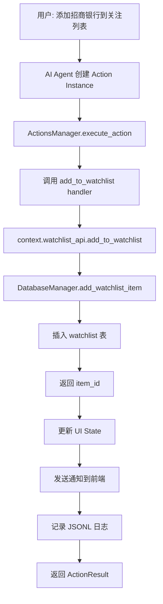

# 关注列表 API 实现文档

## 📝 实现总览

已完整实现 Finance Agent 的关注列表（Watchlist）功能，包括：

- ✅ 数据库表结构（`watchlist`）
- ✅ DatabaseManager CRUD 方法
- ✅ ActionContext.watchlist_api
- ✅ Action 模板集成（`add_to_watchlist.py`）
- ✅ 完整测试验证

---

## 🗄️ 数据库结构

### **watchlist 表**

```sql
CREATE TABLE IF NOT EXISTS watchlist (
  id INTEGER PRIMARY KEY AUTOINCREMENT,
  user_id TEXT DEFAULT 'default',
  target_name TEXT NOT NULL,              -- 标的名称（如：招商银行、上证指数）
  target_type TEXT NOT NULL,              -- 类型：stock/etf/index/industry
  alert_conditions TEXT,                  -- JSON: 提醒条件（可选）
  status TEXT DEFAULT 'active',           -- active/inactive
  notes TEXT,                             -- 备注
  created_at DATETIME DEFAULT CURRENT_TIMESTAMP,
  updated_at DATETIME DEFAULT CURRENT_TIMESTAMP
);
```

**特性：**
- 支持多种资产类型（股票、ETF、指数、行业）
- JSON 格式存储提醒条件（灵活扩展）
- 软删除机制（`status` 字段）
- 自动时间戳更新

**索引：**
```sql
CREATE INDEX idx_watchlist_user ON watchlist(user_id);
CREATE INDEX idx_watchlist_status ON watchlist(status);
CREATE INDEX idx_watchlist_target ON watchlist(target_name);
```

---

## 🔧 DatabaseManager API

### **添加关注项**
```python
item_id = await db.add_watchlist_item(
    target_name="招商银行",
    target_type="stock",
    alert_conditions={"price": "<40"},
    notes="银行板块龙头"
)
```

### **获取关注列表**
```python
# 获取活跃关注项
watchlist = await db.get_watchlist(status="active")

# 获取所有关注项（包括已删除）
all_items = await db.get_watchlist(status="inactive")
```

### **获取单个关注项**
```python
item = await db.get_watchlist_item(item_id)
```

### **更新关注项**
```python
success = await db.update_watchlist_item(
    item_id,
    {'notes': '新的备注', 'alert_conditions': {'price': '<35'}}
)
```

### **删除关注项**
```python
# 软删除（推荐）
await db.remove_watchlist_item(item_id)

# 硬删除（永久删除）
await db.delete_watchlist_item(item_id)
```

---

## 🎯 ActionContext API

在 Action handler 中使用：

```python
from ccsdk.action_context import ActionContext
from ccsdk.types import ActionResult

async def handler(params: dict, context: ActionContext) -> ActionResult:
    # 1. 添加到关注列表
    item_id = await context.watchlist_api.add_to_watchlist(
        target_name="贵州茅台",
        target_type="stock",
        notes="白酒龙头"
    )
    
    # 2. 获取关注列表
    watchlist = await context.watchlist_api.get_watchlist()
    
    # 3. 获取单个关注项
    item = await context.watchlist_api.get_item(item_id)
    
    # 4. 更新关注项
    await context.watchlist_api.update_item(
        item_id,
        {'notes': '新备注'}
    )
    
    # 5. 删除关注项
    await context.watchlist_api.remove_from_watchlist(item_id)
    
    return ActionResult(success=True, message="操作成功")
```

---

## 📦 API 方法列表

### **WatchlistAPI 方法**

| 方法 | 参数 | 返回值 | 说明 |
|------|------|--------|------|
| `add_to_watchlist` | target_name, target_type, notes | int | 添加关注项，返回 ID |
| `get_watchlist` | status="active" | List[Dict] | 获取关注列表 |
| `get_item` | item_id | Dict | 获取单个关注项 |
| `update_item` | item_id, updates | bool | 更新关注项 |
| `remove_from_watchlist` | item_id | bool | 软删除关注项 |
| `delete_item` | item_id | bool | 硬删除关注项 |

---

## 🧪 测试验证

### **运行测试**

```bash
# 测试 DatabaseManager
python scripts/test_watchlist_api.py

# 测试 ActionContext
python scripts/test_action_context_watchlist.py

# 测试 ActionsManager 集成
python scripts/test_actions_manager.py
```

### **测试结果**

```
✅ 成功添加关注项 (stock, etf, index)
✅ 成功获取关注列表
✅ 成功更新关注项
✅ 成功软删除关注项
✅ 成功硬删除关注项
✅ JSON 字段序列化/反序列化正常
✅ ActionContext.watchlist_api 所有方法正常
✅ Action 模板 add_to_watchlist 执行成功
```

---

## 📋 Action 模板示例

### **add_to_watchlist.py**

```python
# Action 配置
config = {
    'id': 'add_to_watchlist',
    'name': '添加到关注列表',
    'description': '将标的添加到用户的关注列表',
    'icon': '⭐',
    'parameterSchema': {
        'type': 'object',
        'properties': {
            'target_name': {
                'type': 'string',
                'description': '标的名称（如: 招商银行、上证指数）'
            },
            'target_type': {
                'type': 'string',
                'enum': ['stock', 'etf', 'index', 'industry'],
                'description': '标的类型',
                'default': 'stock'
            }
        },
        'required': ['target_name']
    }
}

async def handler(params: dict, context: ActionContext) -> ActionResult:
    target_name = params['target_name']
    target_type = params.get('target_type', 'stock')
    
    # 添加到关注列表
    item_id = await context.watchlist_api.add_to_watchlist(
        target_name=target_name,
        target_type=target_type,
        notes=f"通过 Action 添加: {target_type}"
    )
    
    # 更新 UI State
    watchlist = await context.watchlist_api.get_watchlist()
    current_state = await context.ui_state.get('watchlist_tracker')
    if current_state:
        current_state['items'] = watchlist
        await context.ui_state.set('watchlist_tracker', current_state)
    
    # 发送通知
    await context.notify(
        f"已添加 {target_name} 到关注列表",
        priority="normal",
        type="success"
    )
    
    return ActionResult(
        success=True,
        message=f'已添加 {target_name} 到关注列表',
        data={
            'item_id': item_id,
            'target_name': target_name,
            'total_items': len(watchlist)
        }
    )
```

---

## 🔄 完整工作流程



---

## 📊 数据流示例

### **用户请求**
```json
{
  "instanceId": "act_001",
  "templateId": "add_to_watchlist",
  "params": {
    "target_name": "招商银行",
    "target_type": "stock"
  }
}
```

### **数据库记录**
```json
{
  "id": 1,
  "user_id": "default",
  "target_name": "招商银行",
  "target_type": "stock",
  "alert_conditions": null,
  "status": "active",
  "notes": "通过 Action 添加: stock",
  "created_at": "2025-12-01 08:08:01",
  "updated_at": "2025-12-01 08:08:01"
}
```

### **返回结果**
```json
{
  "success": true,
  "message": "已添加 招商银行 到关注列表",
  "data": {
    "item_id": 1,
    "target_name": "招商银行",
    "target_type": "stock",
    "total_items": 1
  }
}
```

---

## 🚀 使用场景

### **场景 1：添加股票到关注列表**
```python
# 用户: "帮我关注一下招商银行"
await context.watchlist_api.add_to_watchlist(
    target_name="招商银行",
    target_type="stock"
)
```

### **场景 2：批量添加 ETF**
```python
etfs = ["黄金ETF", "沪深300ETF", "中证500ETF"]
for etf in etfs:
    await context.watchlist_api.add_to_watchlist(
        target_name=etf,
        target_type="etf"
    )
```

### **场景 3：设置价格提醒条件**
```python
await context.watchlist_api.add_to_watchlist(
    target_name="贵州茅台",
    target_type="stock",
    alert_conditions={
        "price_below": 1500,
        "price_above": 2000
    }
)
```

### **场景 4：查看关注列表**
```python
# 用户: "我关注了哪些股票？"
watchlist = await context.watchlist_api.get_watchlist()
stocks = [item for item in watchlist if item['target_type'] == 'stock']
```

---

## 📈 下一步计划

根据之前的功能分析，建议的实现顺序：

### **Phase 2: 市场数据 API**
- [ ] 集成 AKShare
- [ ] 实现实时行情获取
- [ ] 实现历史数据查询

### **Phase 3: 价格提醒 API**
- [ ] 添加 `price_alerts` 表
- [ ] 实现价格监控后台任务
- [ ] 集成通知系统

### **Phase 4: 投资组合 API**
- [ ] 添加 `portfolio` 表
- [ ] 实现持仓管理
- [ ] 计算收益率和资产配置

---

## ✅ 已完成功能清单

- ✅ 数据库表设计和创建（`watchlist`）
- ✅ DatabaseManager CRUD 方法（6个方法）
- ✅ ActionContext.watchlist_api（6个 API）
- ✅ Action 模板更新（真实数据库操作）
- ✅ 完整测试覆盖（3个测试脚本）
- ✅ JSON 序列化/反序列化支持
- ✅ 软删除机制
- ✅ 自动时间戳更新
- ✅ 多资产类型支持
- ✅ 与 ActionsManager 完整集成

---

## 📖 参考文档

- [FEATURES_ROADMAP.md](../FEATURES_ROADMAP.md) - 功能规划
- [ACTIONS_MANAGER_README.md](../ACTIONS_MANAGER_README.md) - ActionsManager 文档
- [database/schema.sql](../database/schema.sql) - 数据库结构
- [ccsdk/action_context.py](../ccsdk/action_context.py) - ActionContext 实现

---

**实现日期：** 2025-12-01  
**实现状态：** ✅ 完成  
**测试状态：** ✅ 通过  
