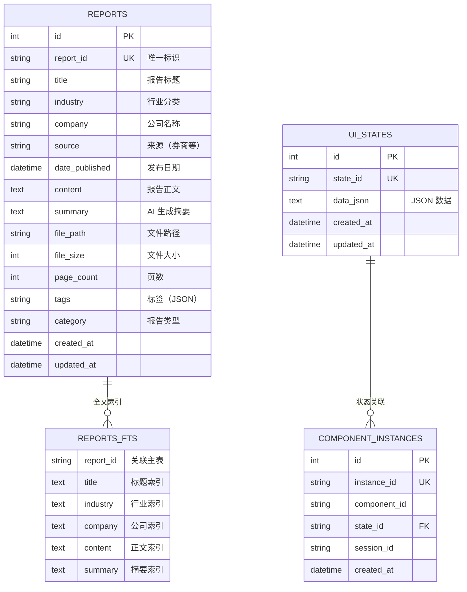
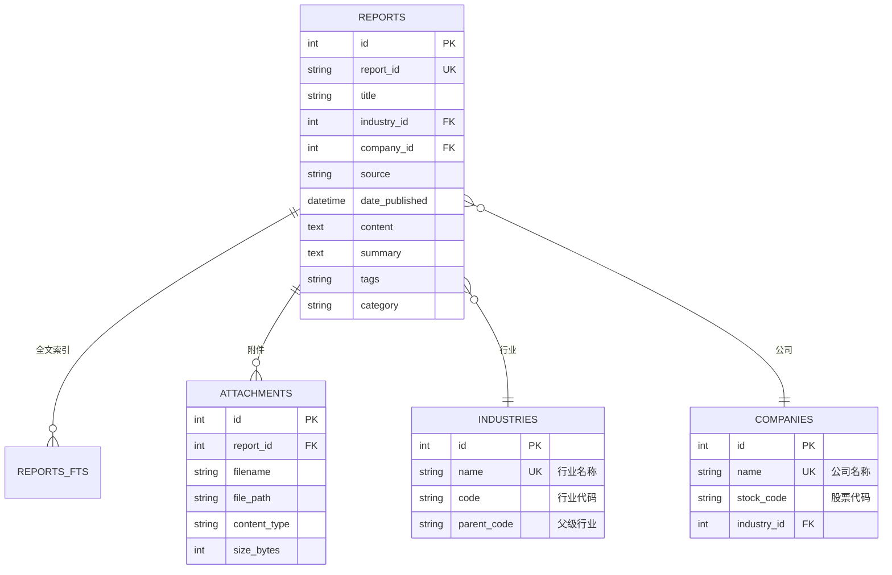

# Finance Agent 数据库设计（金融分析报告系统）

> **版本**：2.0 (基于实际数据优化)  
> **业务场景**：市场策略报告、行业分析、投资建议的智能管理和检索系统  
> **数据特征**：长文本内容 + 高度结构化的分析数据（JSON）  
> **数据库选型**：SQLite + FTS5（全文搜索）+ JSON 存储  
> **设计日期**：2025-11-27

---

## 📋 实际数据示例

本设计基于真实的金融分析报告数据：
- **原始文本**：`A股4000拉锯要不要买黄金_20251126102506_11_342_cleaned.txt`（3000+ 字）
- **结构化数据**：`analysis_A股与黄金综合策略_20251127_105237.json`（207 行）

**数据特点**：
- ✅ 长文本内容需要全文搜索
- ✅ 高度结构化的分析结果（27个关键数据点）
- ✅ 多层嵌套的 JSON 结构（投资建议、风险预警、时间线）
- ✅ 量化评分体系（重要性、紧急性、可靠性）

---

## 目录
- [1. 业务需求分析](#1-业务需求分析)
- [2. 实体关系图（ER 图）](#2-实体关系图er-图)
- [3. 表结构设计](#3-表结构设计)
- [4. 索引策略](#4-索引策略)
- [5. 查询场景示例](#5-查询场景示例)

---

# 1. 业务需求分析

### 核心功能
1. **报告管理**：存储、检索、分类市场策略报告和投资分析
2. **全文搜索**：快速搜索报告内容中的关键词（如"黄金"、"A股"、"ETF"）
3. **结构化查询**：
   - 按投资建议筛选（buy/sell/hold/watch）
   - 按重要性评分排序
   - 按时间范围检索
   - 按风险等级分类
4. **AI 辅助**：自动提取关键数据、生成摘要、评分
5. **状态管理**：UI 状态持久化（与 Email Agent 一致）

### 数据分类

| 表类型 | 说明 | Finance Agent 必需性 |
|--------|------|---------------------|
| **系统核心表** | 所有 Agent 通用 | ✅ 必需 |
| - ui_states | UI 状态存储 | ✅ |
| - component_instances | 组件实例管理 | ✅ |
| **业务数据表** | 报告分析专用 | ✅ 必需 |
| - reports | 报告主表 | ✅ |
| - reports_fts | 全文搜索虚拟表 | ✅ |
| **辅助表** | 可选功能 | ⚪ MVP 可选 |
| - attachments | 附件管理（PDF 文件） | ⚪ |
| - industries | 行业字典表 | ⚪ |
| - companies | 公司字典表 | ⚪ |

---

## 2. 实体关系图（ER 图）

### MVP 最小化设计



### 完整设计（包含可选表）



**MVP 建议**：使用第一个最小化设计，行业和公司直接用字符串存储。

---

## 3. 表结构设计

### 3.1 报告主表（reports）

```sql
CREATE TABLE reports (
  -- 主键和唯一标识
  id INTEGER PRIMARY KEY AUTOINCREMENT,
  report_id TEXT UNIQUE NOT NULL,
  
  -- 核心元数据
  title TEXT NOT NULL,
  industry TEXT,                  -- 行业分类（如："人工智能", "新能源"）
  company TEXT,                   -- 公司名称（如："腾讯控股"）
  source TEXT,                    -- 来源（如："中信证券", "高盛"）
  date_published DATETIME NOT NULL,
  
  -- 内容字段
  content TEXT,                   -- 报告正文（长文本，可能数万字）
  summary TEXT,                   -- AI 生成的摘要（可选）
  
  -- 文件信息
  file_path TEXT,                 -- 原始文件路径（如："./data/reports/2024/01/report_123.pdf"）
  file_size INTEGER,              -- 文件大小（字节）
  page_count INTEGER,             -- 页数
  
  -- 分类和标签
  tags TEXT,                      -- JSON 数组，如：["AI", "云计算", "财报分析"]
  category TEXT,                  -- 报告类型："行业研报" | "公司研报" | "宏观报告" | "策略报告"
  
  -- 系统字段
  created_at DATETIME DEFAULT CURRENT_TIMESTAMP,
  updated_at DATETIME DEFAULT CURRENT_TIMESTAMP
);
```

**字段说明**：

| 字段 | 类型 | 说明 | 示例 |
|------|------|------|------|
| `report_id` | TEXT | 唯一标识符 | `"RPT_20240115_001"` |
| `title` | TEXT | 报告标题 | `"2024年人工智能行业深度研究报告"` |
| `industry` | TEXT | 行业分类 | `"人工智能"` |
| `company` | TEXT | 公司名称（公司研报） | `"腾讯控股"` |
| `source` | TEXT | 发布机构 | `"中信证券"` |
| `date_published` | DATETIME | 发布日期 | `2024-01-15` |
| `content` | TEXT | 报告正文 | `"一、行业概述\n人工智能..."` |
| `summary` | TEXT | AI 摘要 | `"本报告分析了..."` |
| `tags` | TEXT (JSON) | 标签数组 | `["AI", "GPT", "大模型"]` |
| `category` | TEXT | 报告分类 | `"行业研报"` |

---

### 3.2 全文搜索表（reports_fts）

```sql
CREATE VIRTUAL TABLE reports_fts USING fts5(
  report_id UNINDEXED,    -- 不索引，用于关联
  title,                  -- 索引标题
  industry,               -- 索引行业
  company,                -- 索引公司
  content,                -- 索引正文（重点）
  summary,                -- 索引摘要
  tokenize = 'porter unicode61'  -- 支持中英文分词
);
```

**FTS5 特性**：
- ✅ 支持中文分词（unicode61）
- ✅ 支持词干提取（porter）
- ✅ 支持 BM25 相关性排序
- ✅ 查询速度极快（毫秒级）

---

### 3.3 自动同步触发器

```sql
-- 插入时自动同步到 FTS 表
CREATE TRIGGER reports_fts_insert
AFTER INSERT ON reports
BEGIN
  INSERT INTO reports_fts(report_id, title, industry, company, content, summary)
  VALUES (NEW.report_id, NEW.title, NEW.industry, NEW.company, NEW.content, NEW.summary);
END;

-- 更新时自动同步
CREATE TRIGGER reports_fts_update
AFTER UPDATE ON reports
BEGIN
  UPDATE reports_fts
  SET title = NEW.title,
      industry = NEW.industry,
      company = NEW.company,
      content = NEW.content,
      summary = NEW.summary
  WHERE report_id = NEW.report_id;
END;

-- 删除时自动清理
CREATE TRIGGER reports_fts_delete
AFTER DELETE ON reports
BEGIN
  DELETE FROM reports_fts WHERE report_id = OLD.report_id;
END;
```

---

### 3.4 系统核心表（ui_states）

```sql
CREATE TABLE ui_states (
  id INTEGER PRIMARY KEY AUTOINCREMENT,
  state_id TEXT UNIQUE NOT NULL,
  data_json TEXT NOT NULL,
  created_at DATETIME DEFAULT CURRENT_TIMESTAMP,
  updated_at DATETIME DEFAULT CURRENT_TIMESTAMP
);

-- 自动更新时间戳
CREATE TRIGGER update_ui_states_timestamp
AFTER UPDATE ON ui_states
FOR EACH ROW
BEGIN
  UPDATE ui_states SET updated_at = CURRENT_TIMESTAMP WHERE id = NEW.id;
END;
```

**用途**：
- 存储 AI 生成的动态 UI 组件状态
- 例如：报告分类统计、行业趋势图、热门公司列表

---

### 3.5 组件实例表（component_instances）

```sql
CREATE TABLE component_instances (
  id INTEGER PRIMARY KEY AUTOINCREMENT,
  instance_id TEXT UNIQUE NOT NULL,
  component_id TEXT NOT NULL,
  state_id TEXT NOT NULL,
  session_id TEXT,
  created_at DATETIME DEFAULT CURRENT_TIMESTAMP
);
```

---

## 4. 索引策略

### 4.1 核心索引

```sql
-- 1. 日期索引（最常用的排序字段）
CREATE INDEX idx_reports_date ON reports(date_published DESC);

-- 2. 行业索引（筛选查询）
CREATE INDEX idx_reports_industry ON reports(industry);

-- 3. 公司索引（公司研报查询）
CREATE INDEX idx_reports_company ON reports(company);

-- 4. 分类索引（报告类型筛选）
CREATE INDEX idx_reports_category ON reports(category);

-- 5. 来源索引（按券商筛选）
CREATE INDEX idx_reports_source ON reports(source);

-- 6. 复合索引（常见组合查询）
CREATE INDEX idx_reports_industry_date ON reports(industry, date_published DESC);
```

### 4.2 系统表索引

```sql
CREATE INDEX idx_ui_states_state_id ON ui_states(state_id);
CREATE INDEX idx_ui_states_updated_at ON ui_states(updated_at);
CREATE INDEX idx_component_instances_instance_id ON component_instances(instance_id);
CREATE INDEX idx_component_instances_state_id ON component_instances(state_id);
CREATE INDEX idx_component_instances_session_id ON component_instances(session_id);
```

---

## 5. 查询场景示例

### 5.1 全文搜索

```sql
-- 搜索包含"人工智能"的报告（带相关性排序）
SELECT 
  r.*,
  rank AS relevance_score
FROM reports r
JOIN reports_fts fts ON r.report_id = fts.report_id
WHERE reports_fts MATCH '人工智能'
ORDER BY rank
LIMIT 20;
```

### 5.2 高级搜索（布尔查询）

```sql
-- 搜索包含"AI"且包含"金融"但不包含"房地产"的报告
SELECT r.*
FROM reports r
JOIN reports_fts fts ON r.report_id = fts.report_id
WHERE reports_fts MATCH 'AI AND 金融 NOT 房地产'
ORDER BY r.date_published DESC;
```

### 5.3 短语搜索

```sql
-- 搜索包含完整短语"数字化转型"的报告
SELECT r.*
FROM reports r
JOIN reports_fts fts ON r.report_id = fts.report_id
WHERE reports_fts MATCH '"数字化转型"'
ORDER BY rank;
```

### 5.4 行业筛选 + 关键词

```sql
-- 金融行业中提到"区块链"的报告
SELECT r.*
FROM reports r
JOIN reports_fts fts ON r.report_id = fts.report_id
WHERE r.industry = '金融'
  AND reports_fts MATCH '区块链'
ORDER BY r.date_published DESC;
```

### 5.5 公司研报查询

```sql
-- 腾讯的所有研报，按日期倒序
SELECT *
FROM reports
WHERE company = '腾讯控股'
  AND category = '公司研报'
ORDER BY date_published DESC
LIMIT 50;
```

### 5.6 时间范围查询

```sql
-- 2024年的新能源行业报告
SELECT *
FROM reports
WHERE industry = '新能源'
  AND date_published >= '2024-01-01'
  AND date_published < '2025-01-01'
ORDER BY date_published DESC;
```

### 5.7 标签查询

```sql
-- 查找包含"AI"标签的报告
SELECT *
FROM reports
WHERE tags LIKE '%"AI"%'
ORDER BY date_published DESC;
```

### 5.8 统计查询

```sql
-- 各行业报告数量统计
SELECT 
  industry,
  COUNT(*) as count,
  MAX(date_published) as latest_report
FROM reports
GROUP BY industry
ORDER BY count DESC;

-- 各券商发布报告数量
SELECT 
  source,
  COUNT(*) as report_count
FROM reports
GROUP BY source
ORDER BY report_count DESC
LIMIT 10;
```

---

## 6. Python 数据模型（SQLAlchemy）

```python
from sqlalchemy import Column, Integer, String, Text, DateTime, func
from sqlalchemy.ext.declarative import declarative_base

Base = declarative_base()

class Report(Base):
    __tablename__ = 'reports'
    
    id = Column(Integer, primary_key=True, autoincrement=True)
    report_id = Column(String(100), unique=True, nullable=False)
    
    # 核心元数据
    title = Column(String(500), nullable=False)
    industry = Column(String(100))
    company = Column(String(200))
    source = Column(String(200))
    date_published = Column(DateTime, nullable=False, index=True)
    
    # 内容
    content = Column(Text)
    summary = Column(Text)
    
    # 文件信息
    file_path = Column(String(500))
    file_size = Column(Integer)
    page_count = Column(Integer)
    
    # 分类
    tags = Column(Text)  # JSON 字符串
    category = Column(String(50), index=True)
    
    # 系统字段
    created_at = Column(DateTime, server_default=func.now())
    updated_at = Column(DateTime, server_default=func.now(), onupdate=func.now())
    
    def __repr__(self):
        return f"<Report(id={self.report_id}, title={self.title})>"


class UIState(Base):
    __tablename__ = 'ui_states'
    
    id = Column(Integer, primary_key=True, autoincrement=True)
    state_id = Column(String(100), unique=True, nullable=False)
    data_json = Column(Text, nullable=False)
    created_at = Column(DateTime, server_default=func.now())
    updated_at = Column(DateTime, server_default=func.now(), onupdate=func.now())


class ComponentInstance(Base):
    __tablename__ = 'component_instances'
    
    id = Column(Integer, primary_key=True, autoincrement=True)
    instance_id = Column(String(100), unique=True, nullable=False)
    component_id = Column(String(100), nullable=False)
    state_id = Column(String(100), nullable=False)
    session_id = Column(String(100))
    created_at = Column(DateTime, server_default=func.now())
```

---

## 7. 迁移计划

### MVP 表（第一周实现）
1. ✅ `reports`
2. ✅ `reports_fts`
3. ✅ `ui_states`
4. ✅ `component_instances`

### 可选扩展表（后期优化）
1. ⚪ `attachments` - 如果需要管理多个附件
2. ⚪ `industries` - 如果需要行业层级结构
3. ⚪ `companies` - 如果需要公司详细信息

---

## 8. 性能预估

| 数据量级 | FTS5 查询速度 | 索引大小 | 数据库文件大小 |
|---------|--------------|---------|---------------|
| 1,000 份报告 | < 10ms | ~5MB | ~50MB |
| 10,000 份报告 | < 50ms | ~50MB | ~500MB |
| 100,000 份报告 | < 200ms | ~500MB | ~5GB |

**结论**：SQLite + FTS5 完全满足需求，无需引入重量级数据库。

---

## 9. 与 Email Agent 的对比

| 维度 | Email Agent | Finance Agent（报告系统） |
|------|-------------|-------------------------|
| **主表** | `emails` | `reports` |
| **全文搜索** | `emails_fts` | `reports_fts` |
| **核心字段** | subject, bodyText | title, content |
| **分类维度** | folder, labels | industry, category, tags |
| **元数据** | fromAddress, toAddresses | industry, company, source |
| **附件** | attachments 表 | 可选（file_path 字段） |
| **系统表** | ui_states, component_instances | ✅ 完全相同 |

**结论**：**架构完全可复用**！只需修改业务表字段名。

---

## 10. 下一步行动

- [ ] 执行 `database/schema.sql` 创建表结构
- [ ] 测试 FTS5 全文搜索（插入测试数据）
- [ ] 验证索引性能
- [ ] 编写 SQLAlchemy 模型
- [ ] 实现 DatabaseManager 类

**评审通过后即可开始编码！** ✅
